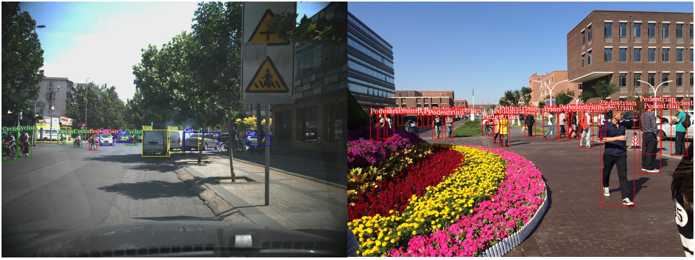

# TJU-DHD: A Diverse High-Resolution Dataset for Object Detection

## Introduction

  Vehicles, pedestrians, and riders are the most important and interesting objects in the perception modules of selfdriving vehicles and video surveillance. However, the state-ofthe-art performance of detecting such important objects (esp. small objects) is far from satisfying the demand of the practical systems. Large-scale, rich-diversity, and high-resolution vehicle and pedestrian datasets play an important role in developing better object detection methods to satisfy the demand. Existing public large-scale datasets such as MS COCO collected from website do not contain enough images under the above scenario. Moreover, the popular datasets (e.g., KITTI and Citypersons) which were collected from the interesting scenario are limited in the number of images and instances, the resolution, and the diversity in seasons, weathers, and illuminations. To attempt to solve the problem, in this paper, we build a diverse high-resolution dataset called (TJU-DHD). The dataset contains 115,354 highresolution images (52% images have resolution of 1624×1200 pixels and 48% images have resolution of at least 2560×1440 pixels) and 709,330 labeled objects in total with a large variance in scale and appearance. Meanwhile, the dataset has a rich diversity in season variance, illumination variance, and weather variance. Based on this object dataset, a new diverse pedestrian dataset is further built. With the four different detectors (i.e., the one-stage RetinaNet, anchor-free FCOS, two-stage FPN, and Cascade RCNN), experiments about object detection and pedestrian detection are conducted. We hope that the newly built dataset can help promote the research on object detection and pedestrian detection in these two scenes. The dataset is available at https://github.com/vilabtju/dhd-dataset.

## Datasets

1. object detection in the DHD

    |  name   | DHD-traffic (\#images)  | DHD-traffic (\#instances)  | DHD-campus (\#images) | DHD-campus (\#instances) |
    | :------------ | :---------------:| :---------------:|:---------------:| :---------------:|    
    | training | 45,266| 239,980 | 39,727| 267,445 |
    | validation | 5,000 | 30,679 | 5,204 | 41,620 |
    | test | 10,000 | 60,963 | 10,157 | 68,643 |
    | total | 60,266 | 331,622 | 55,088 | 377,708 |

    * __DHD-traffic__:
        * training & validation set:
            * images: [OneDrive](https://tjueducn-my.sharepoint.com/:u:/g/personal/hqsun_tju_edu_cn/ERPTtJ9Qf3hHnKn9JQc9_y0B5uaq6qXjnF4U--2wiSTjRw?e=aarX3v)/[GoogleDrive]()/[backup](http://vi.tju.edu.cn/public/dhd_dataset/dhd_traffic_trainval_images.zip)
            * annotations: [OneDrive](https://tjueducn-my.sharepoint.com/:u:/g/personal/hqsun_tju_edu_cn/EY0m5aX84EJFnquyCE8KSp8BiZKTlNHySbdJ0QG-nE2XTQ?e=Abpvgz)/[GoogleDrive]()/[backup](http://vi.tju.edu.cn/public/dhd_dataset/dhd_traffic_trainval_annos.zip)
        * test set:
            * images: [OneDrive](https://tjueducn-my.sharepoint.com/:u:/g/personal/hqsun_tju_edu_cn/EbkVOGVzsoRIhR6u73iAv44BN3n9geqp3R-eTJeZCJen-w?e=az00He)/[GoogleDrive]()/[backup](http://vi.tju.edu.cn/public/dhd_dataset/dhd_traffic_test_images.zip)
            * imageinfo: [OneDrive](https://tjueducn-my.sharepoint.com/:u:/g/personal/hqsun_tju_edu_cn/EfuzQvR7qrhAi8oDMy5PheUBvxSL539oua1kD6g130DChg?e=yOhBGM)/[GoogleDrive]()/[backup](http://vi.tju.edu.cn/public/dhd_dataset/dhd_traffic_test_imageinfo.zip)
        * evaluation tools:
          [cocoapi](https://github.com/cocodataset/cocoapi)
    * __DHD-campus__:
      (The training imageset is too large, thus is ziped as a 4-part archive.
      One should download all of them and open the `.zip.001` using your favorite zip file extractor.)
        * training & validation set:
            * training images-1: [OneDrive](https://tjueducn-my.sharepoint.com/:u:/g/personal/hqsun_tju_edu_cn/EQOf_tTaDz9AtGBA7xXZdMYBmGgEN3wI6pYxdj_sqU9RaA?e=IAa4z4)/[GoogleDrive]()/[backup](http://vi.tju.edu.cn/public/dhd_dataset/dhd_campus_train_images.zip.001)
            * training images-2: [OneDrive](https://tjueducn-my.sharepoint.com/:u:/g/personal/hqsun_tju_edu_cn/EYdb15b5s3hOm_2EWc_uLn8BtpzXnpZJLVRIH6HdbXfbVw?e=hHJNon)/[GoogleDrive]()/[backup](http://vi.tju.edu.cn/public/dhd_dataset/dhd_campus_train_images.zip.002)
            * training images-3: [OneDrive](https://tjueducn-my.sharepoint.com/:u:/g/personal/hqsun_tju_edu_cn/EatVjZJ4uJZGm3OOvdbjheMB6dIOlDumkbhVSMqNZFjSDQ?e=5a9C63)/[GoogleDrive]()/[backup](http://vi.tju.edu.cn/public/dhd_dataset/dhd_campus_train_images.zip.003)
            * training images-4: [OneDrive](https://tjueducn-my.sharepoint.com/:u:/g/personal/hqsun_tju_edu_cn/ERJGIKSOjrVGodjyAtYWOBIBz7Yn3EGGjmtMRDpG9eFlHQ?e=x8MASb)/[GoogleDrive]()/[backup](http://vi.tju.edu.cn/public/dhd_dataset/dhd_campus_train_images.zip.004)
            * validation images: [OneDrive](https://tjueducn-my.sharepoint.com/:u:/g/personal/hqsun_tju_edu_cn/EUHmv-SilRtPlKVuV7TTYlUB24CVeAi9HPto9ZJ6m61kpA?e=aREmy0)/[GoogleDrive]()/[backup](http://vi.tju.edu.cn/public/dhd_dataset/dhd_campus_val_images.zip)
            * annotations: [OneDrive](https://tjueducn-my.sharepoint.com/:u:/g/personal/hqsun_tju_edu_cn/EfJ_SbAK2itJk8kyLBF9ER8BqO0faVumeWn8rPYMkGpqNw?e=Ckc2jn)/[GoogleDrive]()/[backup](http://vi.tju.edu.cn/public/dhd_dataset/dhd_campus_trainval_annos.zip)
        * test set:
            * images: [OneDrive](https://tjueducn-my.sharepoint.com/:u:/g/personal/hqsun_tju_edu_cn/EZZe-4Atw8tEkPdTToNXEboBtdORbKqz2j6asah_hgUgAA?e=ABQibv)/[GoogleDrive]()/[backup](http://vi.tju.edu.cn/public/dhd_dataset/dhd_campus_test_images.zip)
            * imageinfo: [OneDrive](https://tjueducn-my.sharepoint.com/:u:/g/personal/hqsun_tju_edu_cn/EQJpKUI5UUxBuM6ZQGLCLNwBEfGX0tgBR_JyZhAyRp4YYw?e=f6Zrxz)/[GoogleDrive]()/[backup](http://vi.tju.edu.cn/public/dhd_dataset/dhd_campus_test_imageinfo.zip)
        * evaluation tools:
          [cocoapi](https://github.com/cocodataset/cocoapi)

2. pedestrian detection in the DHD

    |  name   | Ped-traffic (\#images)  | Ped-traffic (\#instances)  | Ped-campus (\#images) | Ped-campus (\#instances) |
    | :------------ | :---------------:| :---------------:|:---------------:| :---------------:|    
    | training | 13,858| 27,650 | 39,727| 234,455 |
    | validation | 2,136 | 5,244 | 5,204 | 36,161 |
    | test | 4,344 | 10,724 | 10,157 | 59,007 |
    | total | 20,338 | 43,618 | 55,088 | 329,623 |

    * __Ped-traffic__:
      (Note that the images are same as those in the DHD-traffic)
        * training & validation set:
            * images: [OneDrive](https://tjueducn-my.sharepoint.com/:u:/g/personal/hqsun_tju_edu_cn/ERPTtJ9Qf3hHnKn9JQc9_y0B5uaq6qXjnF4U--2wiSTjRw?e=aarX3v)/[GoogleDrive]()/[backup](http://vi.tju.edu.cn/public/dhd_dataset/dhd_traffic_trainval_images.zip)
            * annotations: [OneDrive](https://tjueducn-my.sharepoint.com/:u:/g/personal/hqsun_tju_edu_cn/EayPrXiJllVLhhZVpZ6-7_UB3UGHkZv0snIgOQa2VjLAGQ?e=CcMOt7)/[GoogleDrive]()/[backup](http://vi.tju.edu.cn/public/dhd_dataset/dhd_pedestrian_traffic_trainval_annos.zip)
        * test set:
            * images: [OneDrive](https://tjueducn-my.sharepoint.com/:u:/g/personal/hqsun_tju_edu_cn/EbkVOGVzsoRIhR6u73iAv44BN3n9geqp3R-eTJeZCJen-w?e=az00He)/[GoogleDrive]()/[backup](http://vi.tju.edu.cn/public/dhd_dataset/dhd_traffic_test_images.zip)
            * imageinfo: [OneDrive](https://tjueducn-my.sharepoint.com/:u:/g/personal/hqsun_tju_edu_cn/EaqndNLmmcNOsgoHChviMiIB0eedPO6sgdZJBGPjURq2_Q?e=MEZNyD)/[GoogleDrive]()/[backup](http://vi.tju.edu.cn/public/dhd_dataset/dhd_pedestrian_traffic_test_imageinfo.zip)
        * evaluation tools:
          [Citypersons API](https://bitbucket.org/shanshanzhang/citypersons)

    * __Ped-campus__:
      (Note that the images are same as those in the DHD-campus)
        * training & validation set:
            * training images-1: [OneDrive](https://tjueducn-my.sharepoint.com/:u:/g/personal/hqsun_tju_edu_cn/EQOf_tTaDz9AtGBA7xXZdMYBmGgEN3wI6pYxdj_sqU9RaA?e=IAa4z4)/[GoogleDrive]()/[backup](http://vi.tju.edu.cn/public/dhd_dataset/dhd_campus_train_images.zip.001)
            * training images-2: [OneDrive](https://tjueducn-my.sharepoint.com/:u:/g/personal/hqsun_tju_edu_cn/EYdb15b5s3hOm_2EWc_uLn8BtpzXnpZJLVRIH6HdbXfbVw?e=hHJNon)/[GoogleDrive]()/[backup](http://vi.tju.edu.cn/public/dhd_dataset/dhd_campus_train_images.zip.002)
            * training images-3: [OneDrive](https://tjueducn-my.sharepoint.com/:u:/g/personal/hqsun_tju_edu_cn/EatVjZJ4uJZGm3OOvdbjheMB6dIOlDumkbhVSMqNZFjSDQ?e=5a9C63)/[GoogleDrive]()/[backup](http://vi.tju.edu.cn/public/dhd_dataset/dhd_campus_train_images.zip.003)
            * training images-4: [OneDrive](https://tjueducn-my.sharepoint.com/:u:/g/personal/hqsun_tju_edu_cn/ERJGIKSOjrVGodjyAtYWOBIBz7Yn3EGGjmtMRDpG9eFlHQ?e=x8MASb)/[GoogleDrive]()/[backup](http://vi.tju.edu.cn/public/dhd_dataset/dhd_campus_train_images.zip.004)
            * validation images: [OneDrive](https://tjueducn-my.sharepoint.com/:u:/g/personal/hqsun_tju_edu_cn/EUHmv-SilRtPlKVuV7TTYlUB24CVeAi9HPto9ZJ6m61kpA?e=aREmy0)/[GoogleDrive]()/[backup](http://vi.tju.edu.cn/public/dhd_dataset/dhd_campus_val_images.zip)
            * annotations: [OneDrive](https://tjueducn-my.sharepoint.com/:u:/g/personal/hqsun_tju_edu_cn/EfyEXYoJ41BErzFfILHIG9YByAgkl2eFd5qHyVrSuPK9AA?e=s5aalT)/[GoogleDrive]()/[backup](http://vi.tju.edu.cn/public/dhd_dataset/dhd_pedestrian_campus_trainval_annos.zip)
        * test set:
            * images: [OneDrive](https://tjueducn-my.sharepoint.com/:u:/g/personal/hqsun_tju_edu_cn/EZZe-4Atw8tEkPdTToNXEboBtdORbKqz2j6asah_hgUgAA?e=ABQibv)/[GoogleDrive]()/[backup](http://vi.tju.edu.cn/public/dhd_dataset/dhd_campus_test_images.zip)
            * imageinfo: [OneDrive](https://tjueducn-my.sharepoint.com/:u:/g/personal/hqsun_tju_edu_cn/EXaIKrEGScJNulDTzu9NG8kBk18S03yvfKlNR-bS9NPh1g?e=aUUFBJ)/[GoogleDrive]()/[backup](http://vi.tju.edu.cn/public/dhd_dataset/dhd_pedestrian_campus_test_imageinfo.zip)
        * evaluation tools:
          [Citypersons API](https://bitbucket.org/shanshanzhang/citypersons)

## Benchmark

### DHD-traffic

* Results on validation

  |  method   | backbone  | input size  | AP | AP@0.5 | AP@0.75 | AP_s | AP_m | AP_l |
  | :------------ | :-----------:| :-----------:|:-----------:| :----------:|  :-----------:| :----------:|:----------:|:----------:|
  | RetinaNet | ResNet50 | 1333x800 | 53.5| 80.9  | 60.0 | 24.0 | 50.5 | 68.0 |
  | FCOS | ResNet50 | 1333x800  | 53.8| 80.0 | 60.1 | 24.6 | 50.6 | 68.8 |
  | FPN | ResNet50 | 1333x800  | 55.4| 83.4 | 63.0 | 30.4 | 52.2 | 68.2 | 
  | Cascade RCNN | ResNet50 | 1333x800  | 57.9| 82.7 | 66.6 | 32.6 | 54.4 | 71.4 |

### DHD-campus

* Results on validation

  |  method   | backbone  | input size  | AP | AP@0.5 | AP@0.75 | AP_t | AP_s | AP_l | AP_l |
  | :---------- | :---------:| :---------:|:---------:| :---------:|:-----------:| :---------:|:-------:|:-------:|:-------:|
  | RetinaNet | ResNet50 | 1333x800 | 48.4| 79.3  | 52.4 | 4.7 | 27.3 | 56.2 | 73.8 |
  | FCOS | ResNet50 | 1333x800  | 49.3| 73.8 | 53.8 | 5.6 | 29.6 | 55.9 | 74.3 |
  | FPN | ResNet50 | 1333x800  | 52.4| 77.5 | 58.4 | 8.5 | 37.4 | 58.6 |  74.9 | 
  | Cascade RCNN | ResNet50 | 1333x800  | 55.1| 77.6 | 60.9 | 10.8 | 40.1 | 61.2 | 78.8 |

### DHD-pededstrian

* Same-scene evaluation

  |   method  | MR on R/RS/HO/R+HO/A (Ped-campus) | MR on R/RS/HO/R+HO/A (Ped-traffic)  | 
  | --- |:-----------:| :-----------:|
  | FPN | 27.92/73.14/67.52/35.67/38.08 | 22.30/35.19/60.30/26.71/37.78 |

* Cross-scene evaluatioin

  |   method  | MR on R+HO an A   (trained by Ped-campus)  | MR on R+HO and A    (trained by Ped-traffic)  |
  | --- |:--------------------:| :---------------------:|
  | FPN | 24.90 / 34.34 | 29.39 / 43.22 |

## Citation

Please cite our paper if you use our data.

Yanwei Pang, Jiale Cao, Yazhao Li, Jin Xie, Hanqing Sun, and Jinfeng Gong. TJU-DHD: A Diverse High-Resolution Dataset for Object Detection.

## Contact

If you have any questions or want to add your results, please feel free to [contact us](https://github.com/vilabtju/dhd-dataset/issues).
