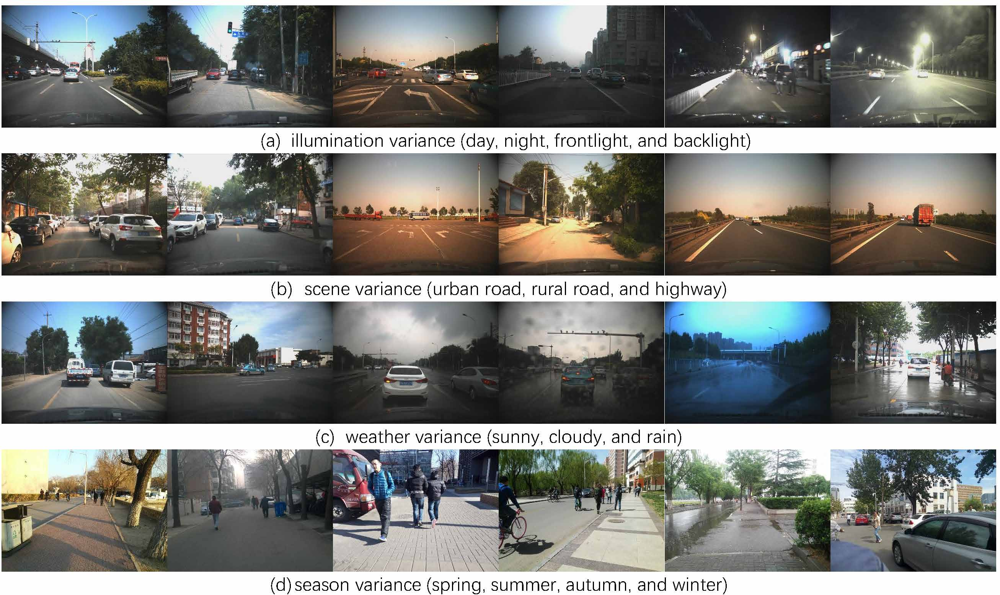

## TJU-DHD dataset (object detection and pedestrian detection)

This is the official website for "*[TJU-DHD: A Diverse High-Resolution Dataset for Object Detection (TIP2020)](https://arxiv.org/abs/2011.09170.pdf)*", which is a newly built high-resolution dataset for object detection and pedestrian detection.
- 115k+ images and 700k+ instances
- Scenes: **traffic** and **campus**, Tasks: **object detection** and **pedestrian detection**
- **High resolution**: image resolution of at least 1624x1200 pixels, the object height from 11 pixels to 4152 pixels.
- **Diversity**: A large variance in appearance, scale, illumination, season, and weather
- **Cross-scene evaluation** and **same-scene evaluation**  on pedestrian detection
- If you are interested in pedestrian detection, please refer to [our IEEE T-PAMI paper](https://arxiv.org/pdf/2010.00456.pdf) or [our github project](https://github.com/JialeCao001/PedSurvey).
- **Learderboard** in Paperswithcode: [TJU-Ped-campus](https://paperswithcode.com/sota/pedestrian-detection-on-tju-ped-campus), [TJU-Ped-traffic](https://paperswithcode.com/sota/pedestrian-detection-on-tju-ped-traffic)




## Table of Contents
1. [Introduction](#1)  
2. [Object detection dataset](#2)  
   2.1 [TJU-DHD-traffic](#2.1)  
   2.2 [TJU-DHD-campus](#2.2)   
3. [Pedestrian detection dataset](#3)  
   3.1 [TJU-Ped-traffic](#3.1)  
   3.2 [TJU-Ped-campus](#3.2)   
4. [Benchmark](#4)  
   4.1 [TJU-DHD-traffic](#4.1)  
   4.2 [TJU-DHD-campus](#4.2)   
   4.3 [TJU-DHD-pedestrian](#4.3) 
5. [Citation](#5)  
6. [Evaluation on the test set](#6) 
7. [Contact](#7) 

## 1. Introduction <a name="1"></a>

Vehicles, pedestrians, and riders are the most important and interesting objects in the perception modules of self-driving vehicles and video surveillance. However, the state-of-the-art performance of detecting such important objects (esp. small objects) is far from satisfying the demand of the practical systems. Large-scale, rich-diversity, and high-resolution vehicle and pedestrian datasets play an important role in developing better object detection methods to satisfy the demand. Existing public large-scale datasets such as MS COCO collected from websites do not focus on these specific scenarios. Moreover, the popular datasets (e.g., KITTI and Citypersons) collected from these specific scenarios are limited in the number of images and instances, the resolution, and the diversity in seasons, weathers, and illuminations. To attempt to solve the problem, in this paper, we build a diverse high-resolution dataset (called TJU-DHD). The dataset contains 115,354 high-resolution images (52% images have a resolution of 1624x1200 pixels and 48% images have a resolution of at least 2,560x1,440 pixels) and 709,330 labeled objects in total with a large variance in scale and appearance. Meanwhile, the dataset has a rich diversity in season variance, illumination variance, and weather variance. Based on this object dataset, a new diverse pedestrian dataset is further built. With the four different detectors (i.e., the one-stage RetinaNet, anchor-free FCOS, two-stage FPN, and Cascade R-CNN), experiments about object detection and pedestrian detection are conducted. We hope that the newly built dataset can help promote the research on object detection and pedestrian detection in these two scenes.
## 2. Object detection dataset <a name="2"></a>

| name       | DHD-traffic (\#images) | DHD-traffic (\#instances) | DHD-campus (\#images) | DHD-campus (\#instances) |
| :--------- | :--------------------: | :-----------------------: | :-------------------: | :----------------------: |
| training   |         45,266         |          239,980          |        39,727         |         267,445          |
| validation |         5,000          |          30,679           |         5,204         |          41,620          |
| test       |         10,000         |          60,963           |        10,157         |          68,643          |
| total      |         60,266         |          331,622          |        55,088         |         377,708          |

#### 2.1 TJU-DHD-traffic <a name="2.1"></a>
* training & validation set:
    * images:
      [OneDrive](https://tjueducn-my.sharepoint.com/:u:/g/personal/hqsun_tju_edu_cn/ERPTtJ9Qf3hHnKn9JQc9_y0B5uaq6qXjnF4U--2wiSTjRw)
      / [BaiduNetDisk (code: biit)](https://pan.baidu.com/s/1eLxfl19LVLy9k-DrqTOYvg?pwd=biit)
      <!-- / [backup](http://biit.tju.edu.cn/public/dhd_dataset/dhd_traffic_trainval_images.zip) -->
        * md5: c5de70827bde72a909a14d91be40ecc7
    * annotations:
      [OneDrive](https://tjueducn-my.sharepoint.com/:u:/g/personal/hqsun_tju_edu_cn/EY0m5aX84EJFnquyCE8KSp8BiZKTlNHySbdJ0QG-nE2XTQ)
      / [BaiduNetDisk (code: biit)](https://pan.baidu.com/s/1xFhMwQgpqk1QILwXS_dR2g?pwd=biit)
      <!-- / [backup](http://biit.tju.edu.cn/public/dhd_dataset/dhd_traffic_trainval_annos.zip) -->
        * md5: 4bb78bbe78166f8904e46a691e6814c4
* test set:
    * images:
      [OneDrive](https://tjueducn-my.sharepoint.com/:u:/g/personal/hqsun_tju_edu_cn/EbkVOGVzsoRIhR6u73iAv44BN3n9geqp3R-eTJeZCJen-w)
      / [BaiduNetDisk (code: biit)](https://pan.baidu.com/s/1b1iR8eujY28qm-pH8rHV-A?pwd=biit)
      <!-- / [backup](http://biit.tju.edu.cn/public/dhd_dataset/dhd_traffic_test_images.zip) -->
        * md5: 74656dde79a4d5e856e31dfc1be30cbe
    * imageinfo:
      [OneDrive](https://tjueducn-my.sharepoint.com/:u:/g/personal/hqsun_tju_edu_cn/EfuzQvR7qrhAi8oDMy5PheUBvxSL539oua1kD6g130DChg)
      / [BaiduNetDisk (code: biit)](https://pan.baidu.com/s/1Np079urN0uQmybBM4RriZA?pwd=biit)
      <!-- / [backup](http://biit.tju.edu.cn/public/dhd_dataset/dhd_traffic_test_imageinfo.zip) -->
        * md5: 458bf63ca74992c3145570cbc62f65fe
* evaluation tools:
  [cocoapi](https://github.com/cocodataset/cocoapi)

#### 2.2 TJU-DHD-campus <a name="2.2"></a>

> The training imageset is too large, thus is ziped as a 4-part archive.
> After downloading all four parts, you can open the `.zip.001` using your favorite zip file extractor.
> On Linux, the multi-part archive can be also unzipped by
> ```
> cat dhd_campus_train_images.zip.* > dhd_campus_train_images.zip
> unzip dhd_campus_train_images.zip -d /path/to/your/folder
> ```

* training & validation set:
    * training images-1:
      [OneDrive](https://tjueducn-my.sharepoint.com/:u:/g/personal/hqsun_tju_edu_cn/EQOf_tTaDz9AtGBA7xXZdMYBmGgEN3wI6pYxdj_sqU9RaA)
      / [BaiduNetDisk (code: biit)](https://pan.baidu.com/s/1aar9GAbityEBMMEnXEwbOA?pwd=biit)
      <!-- / [backup](http://biit.tju.edu.cn/public/dhd_dataset/dhd_campus_train_images.zip.001) -->
        * md5: 1c781e3aab251a19cc8c304ec854b060
    * training images-2:
      [OneDrive](https://tjueducn-my.sharepoint.com/:u:/g/personal/hqsun_tju_edu_cn/EYdb15b5s3hOm_2EWc_uLn8BtpzXnpZJLVRIH6HdbXfbVw)
      / [BaiduNetDisk (code: biit)](https://pan.baidu.com/s/1xWDiok5DTVT8HEMK09DPiA?pwd=biit)
      <!-- / [backup](http://biit.tju.edu.cn/public/dhd_dataset/dhd_campus_train_images.zip.002) -->
        * md5: 502c25eb707718c3e99f4679f53b0fda
    * training images-3:
      [OneDrive](https://tjueducn-my.sharepoint.com/:u:/g/personal/hqsun_tju_edu_cn/EatVjZJ4uJZGm3OOvdbjheMB6dIOlDumkbhVSMqNZFjSDQ)
      / [BaiduNetDisk (code: biit)](https://pan.baidu.com/s/1gUQs6XdUU7fczaydtLPBSg?pwd=biit)
      <!-- / [backup](http://biit.tju.edu.cn/public/dhd_dataset/dhd_campus_train_images.zip.003) -->
        * md5: fc8ca78881eb94c3aa5d8d4ee8db5096
    * training images-4:
      [OneDrive](https://tjueducn-my.sharepoint.com/:u:/g/personal/hqsun_tju_edu_cn/ERJGIKSOjrVGodjyAtYWOBIBz7Yn3EGGjmtMRDpG9eFlHQ)
      / [BaiduNetDisk (code: biit)](https://pan.baidu.com/s/1PncIpCpS_En9Ka0aD6-_lA?pwd=biit)
      <!-- / [backup](http://biit.tju.edu.cn/public/dhd_dataset/dhd_campus_train_images.zip.004) -->
        * md5: a3b33b17f0c89e57180bc174332ee764
    * validation images:
      [OneDrive](https://tjueducn-my.sharepoint.com/:u:/g/personal/hqsun_tju_edu_cn/EUHmv-SilRtPlKVuV7TTYlUB24CVeAi9HPto9ZJ6m61kpA)
      / [BaiduNetDisk (code: biit)](https://pan.baidu.com/s/1WgbIEXIbGHjh6jBjh_l37A?pwd=biit)
      <!-- / [backup](http://biit.tju.edu.cn/public/dhd_dataset/dhd_campus_val_images.zip) -->
        * md5: 7c8d32bbe38c4231121235965cc1c778
    * annotations:
      [OneDrive](https://tjueducn-my.sharepoint.com/:u:/g/personal/hqsun_tju_edu_cn/EZF2IypQxHxFvzz2tcxZZykBazj1bEE9LE7jf37QBl_GqA)
      / [BaiduNetDisk (code: biit)](https://pan.baidu.com/s/1XC2CaEIofLjjeV5P4LoZrw?pwd=biit)
      <!-- / [backup](http://biit.tju.edu.cn/public/dhd_dataset/dhd_campus_trainval_annos.zip) -->
        * md5: 3d2301befe1fca63f4979454cf228c61
* test set:
    * images:
      [OneDrive](https://tjueducn-my.sharepoint.com/:u:/g/personal/hqsun_tju_edu_cn/EZZe-4Atw8tEkPdTToNXEboBtdORbKqz2j6asah_hgUgAA)
      / [BaiduNetDisk (code: biit)](https://pan.baidu.com/s/1I33BMKvU9WP_nC64wM1hHw?pwd=biit)
      <!-- / [backup](http://biit.tju.edu.cn/public/dhd_dataset/dhd_campus_test_images.zip) -->
        * md5: d0ada536ccb5851b42b656847d5b1e3b
    * imageinfo:
      [OneDrive](https://tjueducn-my.sharepoint.com/:u:/g/personal/hqsun_tju_edu_cn/EUHgzWEC8QNKvdcvWgoEIC0BUGcX5WuIL5kJwSSUCzAycQ)
      / [BaiduNetDisk (code: biit)](https://pan.baidu.com/s/16Jlbw_fXnmOsSjVAVi2eUw?pwd=biit)
      <!-- / [backup](http://biit.tju.edu.cn/public/dhd_dataset/dhd_campus_test_imageinfo.zip) -->
        * md5: c3015863858740561944110aa9ce9b23
* evaluation tools:
  [cocoapi](https://github.com/cocodataset/cocoapi)


## 3. Pedestrian detection dataset<a name="3"></a>

| name       | Ped-traffic (\#images) | Ped-traffic (\#instances) | Ped-campus (\#images) | Ped-campus (\#instances) |
| :--------- | :--------------------: | :-----------------------: | :-------------------: | :----------------------: |
| training   |         13,858         |          27,650           |        39,727         |         234,455          |
| validation |         2,136          |           5,244           |         5,204         |          36,161          |
| test       |         4,344          |          10,724           |        10,157         |          59,007          |
| total      |         20,338         |          43,618           |        55,088         |         329,623          |

#### 3.1 TJU-Ped-traffic <a name="3.1"></a>
(Note that the images are same as those in the TJU-DHD-traffic)
* training & validation set:
    * images:
      [OneDrive](https://tjueducn-my.sharepoint.com/:u:/g/personal/hqsun_tju_edu_cn/ERPTtJ9Qf3hHnKn9JQc9_y0B5uaq6qXjnF4U--2wiSTjRw)
      / [BaiduNetDisk (code: biit)](https://pan.baidu.com/s/1eLxfl19LVLy9k-DrqTOYvg?pwd=biit)
      <!-- / [backup](http://biit.tju.edu.cn/public/dhd_dataset/dhd_traffic_trainval_images.zip) -->
        * md5: c5de70827bde72a909a14d91be40ecc7
    * annotations:
      [OneDrive](https://tjueducn-my.sharepoint.com/:u:/g/personal/hqsun_tju_edu_cn/EZ35hrbp2PlBkim37i9BnecBKPTpYE92WjCD3GCnTDIXHA)
      / [BaiduNetDisk (code: biit)](https://pan.baidu.com/s/1wUdgtibmj16aKXvn57Cnfg?pwd=biit)
      <!-- / [backup](http://biit.tju.edu.cn/public/dhd_dataset/dhd_pedestrian_traffic_trainval_annos.zip) -->
        * md5: 80c434f14283fa169a6fa90b6115c412
* test set:
    * images:
      [OneDrive](https://tjueducn-my.sharepoint.com/:u:/g/personal/hqsun_tju_edu_cn/EbkVOGVzsoRIhR6u73iAv44BN3n9geqp3R-eTJeZCJen-w)
      / [BaiduNetDisk (code: biit)](https://pan.baidu.com/s/1b1iR8eujY28qm-pH8rHV-A?pwd=biit)
      <!-- / [backup](http://biit.tju.edu.cn/public/dhd_dataset/dhd_traffic_test_images.zip) -->
        * md5: 74656dde79a4d5e856e31dfc1be30cbe
    * imageinfo:
      [OneDrive](https://tjueducn-my.sharepoint.com/:u:/g/personal/hqsun_tju_edu_cn/EaqndNLmmcNOsgoHChviMiIB0eedPO6sgdZJBGPjURq2_Q)
      / [BaiduNetDisk (code: biit)](https://pan.baidu.com/s/14KaBUhWWio-KYf_1usMfhw?pwd=biit)
      <!-- / [backup](http://biit.tju.edu.cn/public/dhd_dataset/dhd_pedestrian_traffic_test_imageinfo.zip) -->
        * md5: e60c660de79c70a00795fde5e40fe28e
* evaluation tools:
  [Citypersons API](https://github.com/cvgroup-njust/CityPersons)

#### 3.2 TJU-Ped-campus <a name="3.2"></a>
(Note that the images are same as those in the TJU-DHD-campus)
* training & validation set:
    * training images-1:
      [OneDrive](https://tjueducn-my.sharepoint.com/:u:/g/personal/hqsun_tju_edu_cn/EQOf_tTaDz9AtGBA7xXZdMYBmGgEN3wI6pYxdj_sqU9RaA)
      / [BaiduNetDisk (code: biit)](https://pan.baidu.com/s/1aar9GAbityEBMMEnXEwbOA?pwd=biit)
      <!-- / [backup](http://biit.tju.edu.cn/public/dhd_dataset/dhd_campus_train_images.zip.001) -->
        * md5: 1c781e3aab251a19cc8c304ec854b060
    * training images-2:
      [OneDrive](https://tjueducn-my.sharepoint.com/:u:/g/personal/hqsun_tju_edu_cn/EYdb15b5s3hOm_2EWc_uLn8BtpzXnpZJLVRIH6HdbXfbVw)
      / [BaiduNetDisk (code: biit)](https://pan.baidu.com/s/1xWDiok5DTVT8HEMK09DPiA?pwd=biit)
      <!-- / [backup](http://biit.tju.edu.cn/public/dhd_dataset/dhd_campus_train_images.zip.002) -->
        * md5: 502c25eb707718c3e99f4679f53b0fda
    * training images-3:
      [OneDrive](https://tjueducn-my.sharepoint.com/:u:/g/personal/hqsun_tju_edu_cn/EatVjZJ4uJZGm3OOvdbjheMB6dIOlDumkbhVSMqNZFjSDQ)
      / [BaiduNetDisk (code: biit)](https://pan.baidu.com/s/1gUQs6XdUU7fczaydtLPBSg?pwd=biit)
      <!-- / [backup](http://biit.tju.edu.cn/public/dhd_dataset/dhd_campus_train_images.zip.003) -->
        * md5: fc8ca78881eb94c3aa5d8d4ee8db5096
    * training images-4:
      [OneDrive](https://tjueducn-my.sharepoint.com/:u:/g/personal/hqsun_tju_edu_cn/ERJGIKSOjrVGodjyAtYWOBIBz7Yn3EGGjmtMRDpG9eFlHQ)
      / [BaiduNetDisk (code: biit)](https://pan.baidu.com/s/1PncIpCpS_En9Ka0aD6-_lA?pwd=biit)
      <!-- / [backup](http://biit.tju.edu.cn/public/dhd_dataset/dhd_campus_train_images.zip.004) -->
        * md5: a3b33b17f0c89e57180bc174332ee764
    * validation images:
      [OneDrive](https://tjueducn-my.sharepoint.com/:u:/g/personal/hqsun_tju_edu_cn/EUHmv-SilRtPlKVuV7TTYlUB24CVeAi9HPto9ZJ6m61kpA)
      / [BaiduNetDisk (code: biit)](https://pan.baidu.com/s/1WgbIEXIbGHjh6jBjh_l37A?pwd=biit)
      <!-- / [backup](http://biit.tju.edu.cn/public/dhd_dataset/dhd_campus_val_images.zip) -->
        * md5: 7c8d32bbe38c4231121235965cc1c778
    * annotations:
      [OneDrive](https://tjueducn-my.sharepoint.com/:u:/g/personal/hqsun_tju_edu_cn/ERjUX1n2lzlBhJe1zPFADBkB_8ALKPtCZ_mPkENBit7xug)
      / [BaiduNetDisk (code: biit)](https://pan.baidu.com/s/1HdHjB89SeFPm5Fwc2MQnGw?pwd=biit)
      <!-- / [backup](http://biit.tju.edu.cn/public/dhd_dataset/dhd_pedestrian_campus_trainval_annos.zip) -->
        * md5: 0c3af32827d3694656555630fe345ca0
* test set:
    * images:
      [OneDrive](https://tjueducn-my.sharepoint.com/:u:/g/personal/hqsun_tju_edu_cn/EZZe-4Atw8tEkPdTToNXEboBtdORbKqz2j6asah_hgUgAA)
      / [BaiduNetDisk (code: biit)](https://pan.baidu.com/s/1I33BMKvU9WP_nC64wM1hHw?pwd=biit)
      <!-- / [backup](http://biit.tju.edu.cn/public/dhd_dataset/dhd_campus_test_images.zip) -->
        * md5: d0ada536ccb5851b42b656847d5b1e3b
    * imageinfo:
      [OneDrive](https://tjueducn-my.sharepoint.com/:u:/g/personal/hqsun_tju_edu_cn/Ec12YtC2X4lFi9LyasqcsbIBMw9U4fsPTfdAz_DhETvVcw)
      / [BaiduNetDisk (code: biit)](https://pan.baidu.com/s/1rn2KjXqLOpPgDCumoNN6Zg?pwd=biit)
      <!-- / [backup](http://biit.tju.edu.cn/public/dhd_dataset/dhd_pedestrian_campus_test_imageinfo.zip) -->
        * md5: 0dd0130714017255bea52d85f014f6af
* evaluation tools:
  [Citypersons API](https://github.com/cvgroup-njust/CityPersons)


## 4. Benchmark <a name="4"></a>

#### 4.1 TJU-DHD-traffic <a name="4.1"></a>

* Results on validation

  | method       | backbone | input size |  AP   | AP@0.5 | AP@0.75 | AP_s  | AP_m  | AP_l  |
  | :----------- | :------: | :--------: | :---: | :----: | :-----: | :---: | :---: | :---: |
  | RetinaNet    | ResNet50 |  1333x800  | 53.5  |  80.9  |  60.0   | 24.0  | 50.5  | 68.0  |
  | FCOS         | ResNet50 |  1333x800  | 53.8  |  80.0  |  60.1   | 24.6  | 50.6  | 68.8  |
  | FPN          | ResNet50 |  1333x800  | 55.4  |  83.4  |  63.0   | 30.4  | 52.2  | 68.2  |
  | Cascade RCNN | ResNet50 |  1333x800  | 57.9  |  82.7  |  66.6   | 32.6  | 54.4  | 71.4  |

#### 4.2 TJU-DHD-campus <a name="4.2"></a>

* Results on validation

  | method       | backbone | input size |  AP   | AP@0.5 | AP@0.75 | AP_t  | AP_s  | AP_l  | AP_l  |
  | :----------- | :------: | :--------: | :---: | :----: | :-----: | :---: | :---: | :---: | :---: |
  | RetinaNet    | ResNet50 |  1333x800  | 48.4  |  79.3  |  52.4   |  4.7  | 27.3  | 56.2  | 73.8  |
  | FCOS         | ResNet50 |  1333x800  | 49.3  |  73.8  |  53.8   |  5.6  | 29.6  | 55.9  | 74.3  |
  | FPN          | ResNet50 |  1333x800  | 52.4  |  77.5  |  58.4   |  8.5  | 37.4  | 58.6  | 74.9  |
  | Cascade RCNN | ResNet50 |  1333x800  | 55.1  |  77.6  |  60.9   | 10.8  | 40.1  | 61.2  | 78.8  |

#### 4.3 TJU-DHD-pedestrian <a name="4.3"></a>

* TJU-Ped-campus

|    Method       | publication  |  **R**  | **RS** | **HO** | **R+HO** | **A**| link |
| :--------      | :-----:  | :-------: | :-------: | :-----: | :------: | :------: | :------: |
|  RetinaNet       | ICCV2017    |  34.73 | 82.99 |   71.31  |    42.26     |     44.34   |  [Paper](https://arxiv.org/abs/1708.02002)   |
|  FCOS  | ICCV2019    |  31.89 |   69.04  |  81.28 |   39.38     |     41.62   |  [Paper](https://arxiv.org/abs/1904.01355)   |
|  FPN | ICCV2017    |  27.92 |   67.52 | 73.14 |    35.67     |     38.08  |  [Paper](https://arxiv.org/abs/1612.03144)    |
|  CrowdDet  | CVPR2020    | 25.73 | - |   66.38 |    33.63     |     35.90   |  [Paper](https://openaccess.thecvf.com/content_CVPR_2020/papers/Chu_Detection_in_Crowded_Scenes_One_Proposal_Multiple_Predictions_CVPR_2020_paper.pdf)   |
|  EGCL | IEEE TIP2023    |  24.84 |- |    65.27  |   32.39     |     34.87  |  [Paper](https://arxiv.org/abs/2111.08974)  |
|  DeFCN | CVPR2021    |  32.1 | 62.7 |     72.7  |   39.9     |     42.1 |  [Paper](https://arxiv.org/abs/2012.03544)  |
|  OPL | CVPR2023    |  31.5 | 61.7 |    72.4  |   39.3     |     41.5  |  [Paper](https://openaccess.thecvf.com/content/CVPR2023/papers/Song_Optimal_Proposal_Learning_for_Deployable_End-to-End_Pedestrian_Detection_CVPR_2023_paper.pdf)  |
|  MTOM | WACV2023    |  21.8 | 37.04 |    57.08  |   -     |     -  |  [Paper](https://openaccess.thecvf.com/content/WACV2024/papers/Shastry_Favoring_One_Among_Equals_-_Not_a_Good_Idea_Many-to-One_WACV_2024_paper.pdf)  |

* TJU-Ped-traffic

|    Method       | publication  |  **R**  | **RS** |**HO** | **R+HO** | **A**| link |
| :--------      | :-----:  | :-------: | :-----: | :-----: | :------: | :------: | :------: |
|  RetinaNet       | ICCV2017    |  23.89 | 37.92 |    61.60  |    28.45     |     41.40   |  [Paper](https://arxiv.org/abs/1708.02002)   |
|  FCOS  | ICCV2019    |  24.35 | 37.40|     63.73  |    28.86     |     40.02   |  [Paper](https://arxiv.org/abs/1904.01355)   |
|  FPN | ICCV2017    |  22.30 | 35.19|     60.30 |    26.71     |     37.78  |  [Paper](https://arxiv.org/abs/1612.03144)    |
|  CrowdDet  | CVPR2020    | 20.82 | -|     61.22  |    25.28     |     36.94   |  [Paper](https://openaccess.thecvf.com/content_CVPR_2020/papers/Chu_Detection_in_Crowded_Scenes_One_Proposal_Multiple_Predictions_CVPR_2020_paper.pdf)   |
|  EGCL | IEEE TIP2023    |  19.73 | -|     60.05  |   24.19     |     35.76  |  [Paper](https://openaccess.thecvf.com/content/CVPR2023/papers/Song_Optimal_Proposal_Learning_for_Deployable_End-to-End_Pedestrian_Detection_CVPR_2023_paper.pdf)  |
|  DeFCN | CVPR2021    |  24.2 | 29.1 |     62.8  |   29.0     |     39.7 |  [Paper](https://arxiv.org/abs/2012.03544)  |
|  Pedestron | CVPR2021    |  18.9 | 24.0 |    56.3  |   -    |     -  |  [Paper](https://openaccess.thecvf.com/content/CVPR2021/papers/Hasan_Generalizable_Pedestrian_Detection_The_Elephant_in_the_Room_CVPR_2021_paper.pdf)  |
|  OPL | CVPR2023    |  23.4 | 28.8 |    62.7  |   28.0     |     38.7  |  [Paper](https://openaccess.thecvf.com/content/CVPR2023/papers/Song_Optimal_Proposal_Learning_for_Deployable_End-to-End_Pedestrian_Detection_CVPR_2023_paper.pdf)  |
|  LSFM | CVPR2023    |  18.7 | 24.9 |    56.2  |   -    |     -  |  [Paper](https://openaccess.thecvf.com/content/CVPR2023/papers/Khan_Localized_Semantic_Feature_Mixers_for_Efficient_Pedestrian_Detection_in_Autonomous_CVPR_2023_paper.pdf)  |
|  MTOM | WACV2023    |  17.4 | 24.7 |    52.68  |   -     |     -  |  [Paper](https://openaccess.thecvf.com/content/WACV2024/papers/Shastry_Favoring_One_Among_Equals_-_Not_a_Good_Idea_Many-to-One_WACV_2024_paper.pdf)  |

* Cross-scene evaluation

  | method | R/R+HO (TJU-Ped-campus -> traffic) | R/R+HO (TJU-Ped-traffic -> campus) |
  | :----- | :-----------------------------------------: | :---------------------------------------------: |
  | FPN    |              30.62 / 33.89               |               42.08 / 50.55               |

## 5. Citation <a name="5"></a>

If this project help your research, please consider to cite our works.
```
@article{Pang_DHD_TIP_2020,
         author = {Yanwei Pang and Jiale Cao and Yazhao Li and Jin Xie and Hanqing Sun and Jinfeng Gong},
         title = {TJU-DHD: A Diverse High-Resolution Dataset for Object Detection},
         journal = {IEEE Transactions on Image Processing},
         year = 2021
        }

@article{Cao_PDR_TPAMI_2020,
         author = {Jiale Cao and Yanwei Pang and Jin Xie and Fahad Shahbaz Khan and Ling Shao},
         title = {From Handcrafted to Deep Features for Pedestrian Detection: A Survey},
         journal = {IEEE Transactions on Pattern Analysis and Machine Intelligence},
         year = 2022
        }
```

## 6. Evaluation on the test set <a name="6"></a>

Ablation studies can be conducted on the validation set.
If you would like to evaluate your model on the test set, you can send us (connor#tju.edu.cn, replace `#` with `@`) your detection results in the `json` format.

## 7. Contact <a name="7"></a>

If you have any questions or want to add your results, please feel free to [contact us](https://github.com/vilabtju/dhd-dataset/issues).
