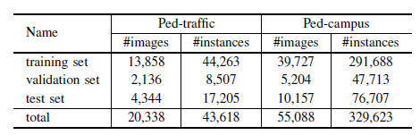
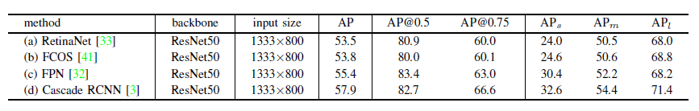

# DHD: A Diverse High-Resolution Dataset for Object Detection and Pedestrian Detection

## Introduction

  The new diverse high-resolution dataset (called DHD) is built to focus on object detection in traffic and campus scenes. The dataset contains 115,354 high-resolution images (at least 1624x1200 pixels) and 709,330 labeled objects in total with a large variance in scale and appearance. Meanwhile, the dataset has a rich diversity in season variance, illumination variance, and weather variance. Based on this object dataset, a new diverse pedestrian dataset is further built. We hope that the newly built dataset can help promote the research on object detection and pedestrian detection in these two scenes.

## Datasets

1. object detection in the DHD

   

    * __DHD-traffic__:
        * training & validation set:
            * images: [OneDrive](https://tjueducn-my.sharepoint.com/:u:/g/personal/hqsun_tju_edu_cn/ERPTtJ9Qf3hHnKn9JQc9_y0B5uaq6qXjnF4U--2wiSTjRw?e=aarX3v)/[GoogleDrive]()/[backup](http://vi.tju.edu.cn/public/dhd_dataset/dhd_traffic_trainval_images.zip)
            * annotations: [OneDrive](https://tjueducn-my.sharepoint.com/:u:/g/personal/hqsun_tju_edu_cn/EY0m5aX84EJFnquyCE8KSp8BiZKTlNHySbdJ0QG-nE2XTQ?e=Abpvgz)/[GoogleDrive]()/[backup](http://vi.tju.edu.cn/public/dhd_dataset/dhd_traffic_trainval_annos.zip)
        * test set:
            * images: [OneDrive](https://tjueducn-my.sharepoint.com/:u:/g/personal/hqsun_tju_edu_cn/EbkVOGVzsoRIhR6u73iAv44BN3n9geqp3R-eTJeZCJen-w?e=az00He)/[GoogleDrive]()/[backup](http://vi.tju.edu.cn/public/dhd_dataset/dhd_traffic_test_images.zip)
            * imageinfo: [OneDrive](https://tjueducn-my.sharepoint.com/:u:/g/personal/hqsun_tju_edu_cn/EfuzQvR7qrhAi8oDMy5PheUBvxSL539oua1kD6g130DChg?e=yOhBGM)/[GoogleDrive]()/[backup](http://vi.tju.edu.cn/public/dhd_dataset/dhd_traffic_test_imageinfo.zip)
        * evaluation tools:
          [cocoapi](https://github.com/cocodataset/cocoapi)
    * __DHD-campus__:
      (The training imageset is too large, thus is ziped as a 4-part archive.
      One should download all of them and open the `.zip.001` using your favorite zip file extractor.)
        * training & validation set:
            * training images-1: [OneDrive](https://tjueducn-my.sharepoint.com/:u:/g/personal/hqsun_tju_edu_cn/EQOf_tTaDz9AtGBA7xXZdMYBmGgEN3wI6pYxdj_sqU9RaA?e=IAa4z4)/[GoogleDrive]()/[backup](http://vi.tju.edu.cn/public/dhd_dataset/dhd_campus_train_images.zip.001)
            * training images-2: [OneDrive](https://tjueducn-my.sharepoint.com/:u:/g/personal/hqsun_tju_edu_cn/EYdb15b5s3hOm_2EWc_uLn8BtpzXnpZJLVRIH6HdbXfbVw?e=hHJNon)/[GoogleDrive]()/[backup](http://vi.tju.edu.cn/public/dhd_dataset/dhd_campus_train_images.zip.002)
            * training images-3: [OneDrive](https://tjueducn-my.sharepoint.com/:u:/g/personal/hqsun_tju_edu_cn/EatVjZJ4uJZGm3OOvdbjheMB6dIOlDumkbhVSMqNZFjSDQ?e=5a9C63)/[GoogleDrive]()/[backup](http://vi.tju.edu.cn/public/dhd_dataset/dhd_campus_train_images.zip.003)
            * training images-4: [OneDrive](https://tjueducn-my.sharepoint.com/:u:/g/personal/hqsun_tju_edu_cn/ERJGIKSOjrVGodjyAtYWOBIBz7Yn3EGGjmtMRDpG9eFlHQ?e=x8MASb)/[GoogleDrive]()/[backup](http://vi.tju.edu.cn/public/dhd_dataset/dhd_campus_train_images.zip.004)
            * validation images: [OneDrive](https://tjueducn-my.sharepoint.com/:u:/g/personal/hqsun_tju_edu_cn/EUHmv-SilRtPlKVuV7TTYlUB24CVeAi9HPto9ZJ6m61kpA?e=aREmy0)/[GoogleDrive]()/[backup](http://vi.tju.edu.cn/public/dhd_dataset/dhd_campus_val_images.zip)
            * annotations: [OneDrive](https://tjueducn-my.sharepoint.com/:u:/g/personal/hqsun_tju_edu_cn/EfJ_SbAK2itJk8kyLBF9ER8BqO0faVumeWn8rPYMkGpqNw?e=Ckc2jn)/[GoogleDrive]()/[backup](http://vi.tju.edu.cn/public/dhd_dataset/dhd_campus_trainval_annos.zip)
        * test set:
            * images: [OneDrive](https://tjueducn-my.sharepoint.com/:u:/g/personal/hqsun_tju_edu_cn/EZZe-4Atw8tEkPdTToNXEboBtdORbKqz2j6asah_hgUgAA?e=ABQibv)/[GoogleDrive]()/[backup](http://vi.tju.edu.cn/public/dhd_dataset/dhd_campus_test_images.zip)
            * imageinfo: [OneDrive](https://tjueducn-my.sharepoint.com/:u:/g/personal/hqsun_tju_edu_cn/EQJpKUI5UUxBuM6ZQGLCLNwBEfGX0tgBR_JyZhAyRp4YYw?e=f6Zrxz)/[GoogleDrive]()/[backup](http://vi.tju.edu.cn/public/dhd_dataset/dhd_campus_test_imageinfo.zip)
        * evaluation tools:
          [cocoapi](https://github.com/cocodataset/cocoapi)

2. pedestrian detection in the DHD

   

    * __Ped-traffic__:
      (Note that the images are same as those in the DHD-traffic)
        * training & validation set:
            * images: [OneDrive](https://tjueducn-my.sharepoint.com/:u:/g/personal/hqsun_tju_edu_cn/ERPTtJ9Qf3hHnKn9JQc9_y0B5uaq6qXjnF4U--2wiSTjRw?e=aarX3v)/[GoogleDrive]()/[backup](http://vi.tju.edu.cn/public/dhd_dataset/dhd_traffic_trainval_images.zip)
            * annotations: [OneDrive](https://tjueducn-my.sharepoint.com/:u:/g/personal/hqsun_tju_edu_cn/EayPrXiJllVLhhZVpZ6-7_UB3UGHkZv0snIgOQa2VjLAGQ?e=CcMOt7)/[GoogleDrive]()/[backup](http://vi.tju.edu.cn/public/dhd_dataset/dhd_pedestrian_traffic_trainval_annos.zip)
        * test set:
            * images: [OneDrive](https://tjueducn-my.sharepoint.com/:u:/g/personal/hqsun_tju_edu_cn/EbkVOGVzsoRIhR6u73iAv44BN3n9geqp3R-eTJeZCJen-w?e=az00He)/[GoogleDrive]()/[backup](http://vi.tju.edu.cn/public/dhd_dataset/dhd_traffic_test_images.zip)
            * imageinfo: [OneDrive](https://tjueducn-my.sharepoint.com/:u:/g/personal/hqsun_tju_edu_cn/EaqndNLmmcNOsgoHChviMiIB0eedPO6sgdZJBGPjURq2_Q?e=MEZNyD)/[GoogleDrive]()/[backup](http://vi.tju.edu.cn/public/dhd_dataset/dhd_pedestrian_traffic_test_imageinfo.zip)
        * evaluation tools:
          [cocoapi](https://github.com/cocodataset/cocoapi)

    * __Ped-campus__:
      (Note that the images are same as those in the DHD-campus)
        * training & validation set:
            * training images-1: [OneDrive](https://tjueducn-my.sharepoint.com/:u:/g/personal/hqsun_tju_edu_cn/EQOf_tTaDz9AtGBA7xXZdMYBmGgEN3wI6pYxdj_sqU9RaA?e=IAa4z4)/[GoogleDrive]()/[backup](http://vi.tju.edu.cn/public/dhd_dataset/dhd_campus_train_images.zip.001)
            * training images-2: [OneDrive](https://tjueducn-my.sharepoint.com/:u:/g/personal/hqsun_tju_edu_cn/EYdb15b5s3hOm_2EWc_uLn8BtpzXnpZJLVRIH6HdbXfbVw?e=hHJNon)/[GoogleDrive]()/[backup](http://vi.tju.edu.cn/public/dhd_dataset/dhd_campus_train_images.zip.002)
            * training images-3: [OneDrive](https://tjueducn-my.sharepoint.com/:u:/g/personal/hqsun_tju_edu_cn/EatVjZJ4uJZGm3OOvdbjheMB6dIOlDumkbhVSMqNZFjSDQ?e=5a9C63)/[GoogleDrive]()/[backup](http://vi.tju.edu.cn/public/dhd_dataset/dhd_campus_train_images.zip.003)
            * training images-4: [OneDrive](https://tjueducn-my.sharepoint.com/:u:/g/personal/hqsun_tju_edu_cn/ERJGIKSOjrVGodjyAtYWOBIBz7Yn3EGGjmtMRDpG9eFlHQ?e=x8MASb)/[GoogleDrive]()/[backup](http://vi.tju.edu.cn/public/dhd_dataset/dhd_campus_train_images.zip.004)
            * validation images: [OneDrive](https://tjueducn-my.sharepoint.com/:u:/g/personal/hqsun_tju_edu_cn/EUHmv-SilRtPlKVuV7TTYlUB24CVeAi9HPto9ZJ6m61kpA?e=aREmy0)/[GoogleDrive]()/[backup](http://vi.tju.edu.cn/public/dhd_dataset/dhd_campus_val_images.zip)
            * annotations: [OneDrive](https://tjueducn-my.sharepoint.com/:u:/g/personal/hqsun_tju_edu_cn/EfyEXYoJ41BErzFfILHIG9YByAgkl2eFd5qHyVrSuPK9AA?e=s5aalT)/[GoogleDrive]()/[backup](http://vi.tju.edu.cn/public/dhd_dataset/dhd_pedestrian_campus_trainval_annos.zip)
        * test set:
            * images: [OneDrive](https://tjueducn-my.sharepoint.com/:u:/g/personal/hqsun_tju_edu_cn/EZZe-4Atw8tEkPdTToNXEboBtdORbKqz2j6asah_hgUgAA?e=ABQibv)/[GoogleDrive]()/[backup](http://vi.tju.edu.cn/public/dhd_dataset/dhd_campus_test_images.zip)
            * imageinfo: [OneDrive](https://tjueducn-my.sharepoint.com/:u:/g/personal/hqsun_tju_edu_cn/EXaIKrEGScJNulDTzu9NG8kBk18S03yvfKlNR-bS9NPh1g?e=aUUFBJ)/[GoogleDrive]()/[backup](http://vi.tju.edu.cn/public/dhd_dataset/dhd_pedestrian_campus_test_imageinfo.zip)
        * evaluation tools:
          [cocoapi](https://github.com/cocodataset/cocoapi)

## Benchmark

### DHD-traffic

### DHD-campus

### DHD-pededstrian

|     | Ped-campus  | Ped-traffic |
| --- |:-----------:| -----------:|
| FPN | 24.90/34.34 | 29.39/43.22 |
